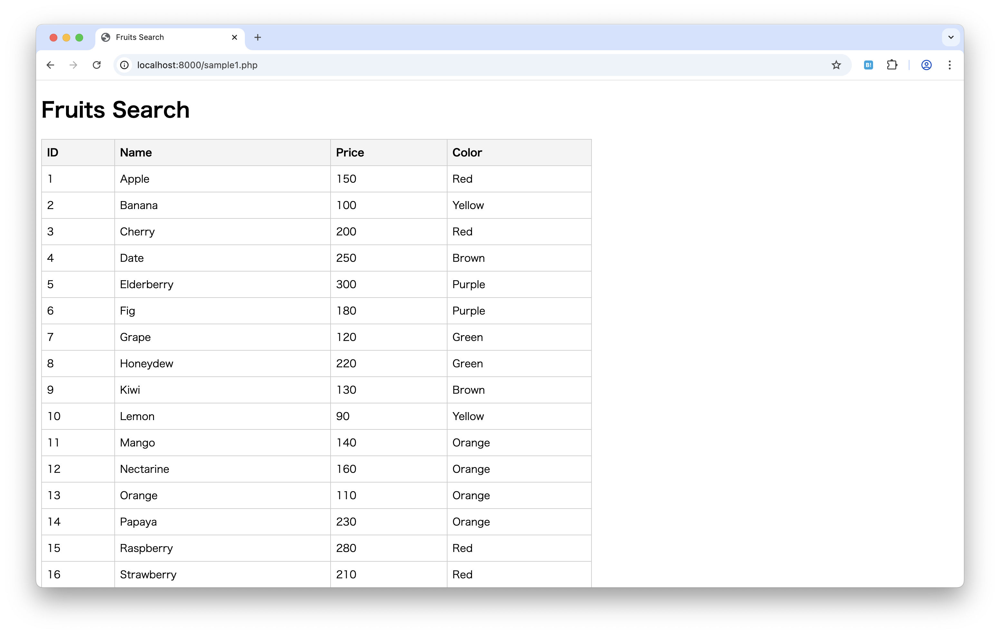
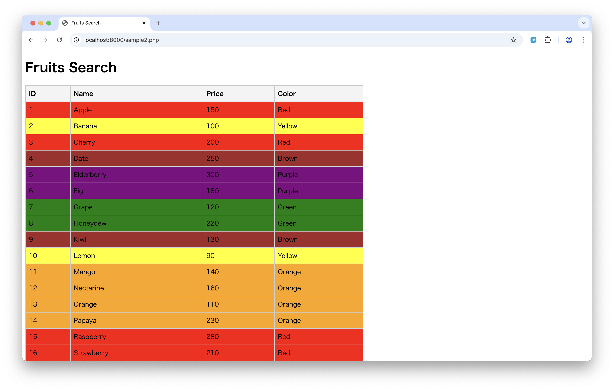
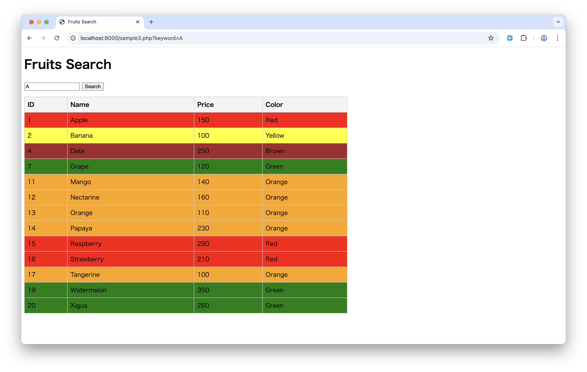
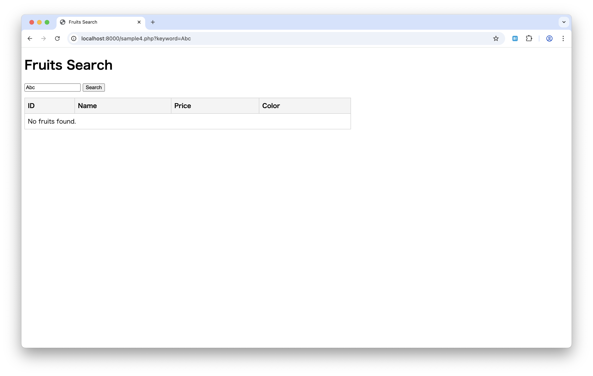

# Fruits Search

## No 1: fruits1.php

以下の配列データを使って、実行結果のように出力してください。

```php
<?php
// フルーツのデータ（A〜Zの果物、各種プロパティ付き）
$fruits = [
    ['id' => 1, 'name' => 'Apple', 'price' => 150, 'color' => 'Red'],
    ['id' => 2, 'name' => 'Banana', 'price' => 100, 'color' => 'Yellow'],
    ['id' => 3, 'name' => 'Cherry', 'price' => 200, 'color' => 'Red'],
    ['id' => 4, 'name' => 'Date', 'price' => 250, 'color' => 'Brown'],
    ['id' => 5, 'name' => 'Elderberry', 'price' => 300, 'color' => 'Purple'],
    ['id' => 6, 'name' => 'Fig', 'price' => 180, 'color' => 'Purple'],
    ['id' => 7, 'name' => 'Grape', 'price' => 120, 'color' => 'Green'],
    ['id' => 8, 'name' => 'Honeydew', 'price' => 220, 'color' => 'Green'],
    ['id' => 9, 'name' => 'Kiwi', 'price' => 130, 'color' => 'Brown'],
    ['id' => 10, 'name' => 'Lemon', 'price' => 90, 'color' => 'Yellow'],
    ['id' => 11, 'name' => 'Mango', 'price' => 140, 'color' => 'Orange'],
    ['id' => 12, 'name' => 'Nectarine', 'price' => 160, 'color' => 'Orange'],
    ['id' => 13, 'name' => 'Orange', 'price' => 110, 'color' => 'Orange'],
    ['id' => 14, 'name' => 'Papaya', 'price' => 230, 'color' => 'Orange'],
    ['id' => 15, 'name' => 'Raspberry', 'price' => 280, 'color' => 'Red'],
    ['id' => 16, 'name' => 'Strawberry', 'price' => 210, 'color' => 'Red'],
    ['id' => 17, 'name' => 'Tangerine', 'price' => 100, 'color' => 'Orange'],
    ['id' => 18, 'name' => 'Ugli', 'price' => 240, 'color' => 'Orange'],
    ['id' => 19, 'name' => 'Watermelon', 'price' => 350, 'color' => 'Green'],
    ['id' => 20, 'name' => 'Xigua', 'price' => 260, 'color' => 'Green'],
    ['id' => 21, 'name' => 'Yuzu', 'price' => 290, 'color' => 'Yellow'],
    ['id' => 22, 'name' => 'Zucchini', 'price' => 150, 'color' => 'Green'],
];
```



---

## No 2: fruits2.php

次の実行結果のように出力してください。

- 行ごとに背景色を付けます



---

## No 3: fruits3.php

次の実行結果のように出力してください。

- 検索機能を追加します



---

## No 4: fruits4.php

次の実行結果のように出力してください。

- 検索結果が0件の場合、`No fruits found.` を表示します



---
